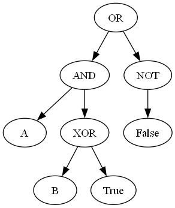

# PLYDev

Utilisation de la liprairie PLY (lex/yacc analyse pour une syntaxe logique)

- Génération de la syntaxe JSON
- Génération de la syntaxe Grafviz
- Production de la représentation graphique

# Exemple

        "A AND (B XOR TRUE) OR NOT FALSE"

# JSON:

        {
          "type": "OR",
          "left": {
            "type": "AND",
            "left": {
              "type": "VAR",
              "name": "A"
            },
            "right": {
              "type": "XOR",
              "left": {
                "type": "VAR",
                "name": "B"
              },
              "right": {
                "type": "CONST",
                "value": true
              }
            }
          },
          "right": {
            "type": "NOT",
            "operand": {
              "type": "CONST",
              "value": false
            }
          }
        }
